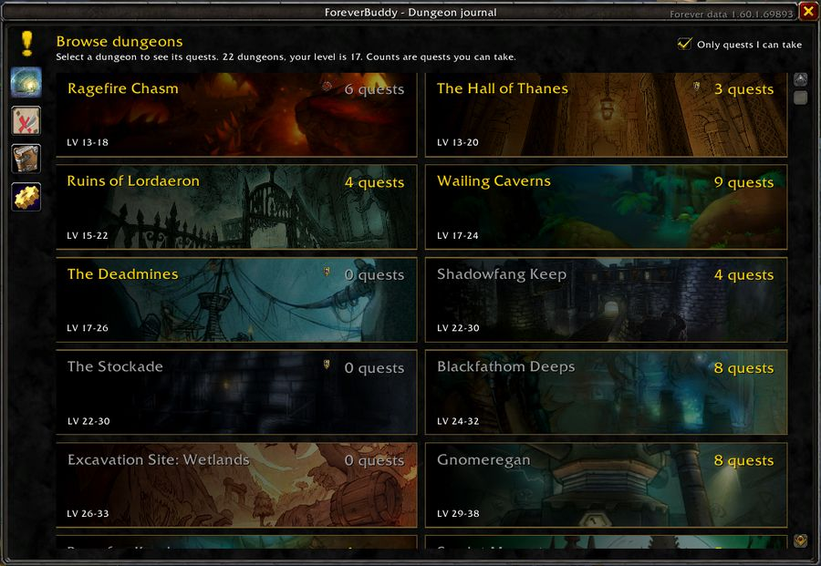
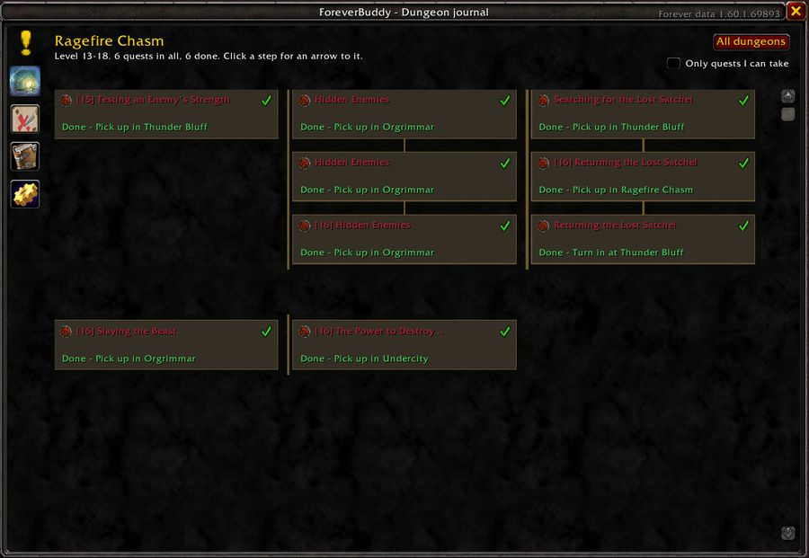
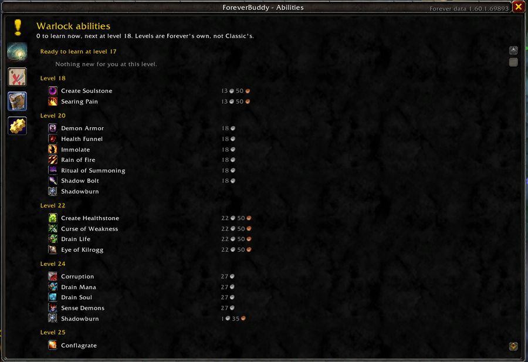

<p align="center">
  
</p>

<h1 align="center">ForeverBuddy</h1>

<p align="center">
  A quality-of-life addon for <strong>World of Warcraft: Forever</strong>.<br>
  Everything in it is a switch. Nothing runs unless you leave it on.
</p>

<p align="center">
  
  
  
</p>

It answers the questions you would otherwise alt-tab for: what is this item for, where do I get
this dungeon quest, where should I level next, and what does my class learn at the trainer.



## What it does

**Dungeon journal.** Every quest tied to a dungeon: who gives it, where they stand, whether the
group can share it, and the chain that comes before it. Click a step for an arrow to it. Quests
for one side wear that side's emblem, the whole length of a chain.

**Abilities.** What your class can train right now, and every level above you to 60, with the
price a trainer charges once somebody has recorded one. Level data for abilities is based on the
WoW: Forever client, as they sometimes differ from Classic: a paladin gets Hammer of Justice at
8 here, not 20.

**Where to level.** Every zone by level, with the ranges written over the continent map, and one
click to light a zone up on it.

**City maps.** Class trainers, profession trainers, weapon masters, the bank, the auction house
and the flight master, each its own switch, each class and profession its own tick.

**Tooltips.** Which quests and recipes need an item, coloured by how far through those quests you
are, and whether it is safe to vendor.

**At the vendor.** Repairs your gear and sells your greys. Quests can accept and hand in
themselves, and Shift does it by hand.

`/fb` opens the window. `/fb dungeon`, `/fb zones`, `/fb abilities` and `/fb settings` go
straight to a page.

## What it looks like

A dungeon's chains, with where each step is picked up and a tick on what you have finished:



Every ability your class trains, with what a trainer charges where somebody has recorded one:



A capital, with each kind of trainer its own switch and each class and profession its own tick:


Level ranges written over every zone of a continent:


## Installing

Download the newest release, unzip it, and put the `ForeverBuddy` folder in
`World of Warcraft\_classic_\Interface\AddOns`. There should be a `ForeverBuddy.toc` directly
inside it.

## Recording data

Forever is new, and a lot of it is published nowhere. With **Help improve the data** left on, the
addon writes what the game shows *you* into its own saved-variables file: quests and who gave
them, what trainers teach, what drops from what, and where your talent points went.

It never records chat, keystrokes, other players, or anything from combat, and it never sends
anything anywhere. The file stays on your computer until you choose to share it. `/fb collect`
explains it in game, and `/fb collect off` stops it.

**Sending yours in.** Log out, then find
`World of Warcraft\_classic_\WTF\Account\<your account>\SavedVariables\ForeverBuddy.lua` and
attach it to an issue here, or send it to Leemo on Discord. GitHub will not accept a `.lua`
attachment, so zip it or rename it to `.txt`. The file names the characters you played on, since
talent choices are recorded per character; Discord is the better route if you would rather that
were not public.

## Where the data comes from

| What | Source |
|---|---|
| Quests, dungeon quests, NPC positions | [Questie](https://github.com/Questie/Questie)'s Classic database (GPL-3.0) |
| Item stats and stat weights | [WoWSims](https://github.com/wowsims) Classic (MIT) |
| Item and recipe tables, maps, loading screens | The Forever client's own data files, via [wago.tools](https://wago.tools) |
| Class ability levels | Wowhead's Forever data, corrected by trainer lists players record |
| Forever's own dungeons and zones | Players, and the client's content tuning |

## Licence

GPL-3.0. ForeverBuddy's dungeon and quest data is derived from **Questie**, which is GPL-3.0, so
this addon is too. Credit and thanks to the Questie team, to WoWSims for the stat weights, and to
wago.tools for making the client's own tables readable.

Not affiliated with Blizzard Entertainment. World of Warcraft is a trademark of Blizzard
Entertainment, Inc.

## Contact

Found a bug, or have a dungeon quest write-up for one of Forever's own dungeons? Open an issue
here, or find **Leemo** on Discord.

## Contributing

Bug reports and dungeon quest write-ups are welcome, especially for Forever's own dungeons.
`docs/DEVELOPMENT.md` covers the layout, the generators under `tools/`, and how to run the tests:

```sh
sh tests/run.sh                                   # the addon, under a fake client
python3 -m unittest discover -s tools -p 'test_*.py'   # the data generators
```
