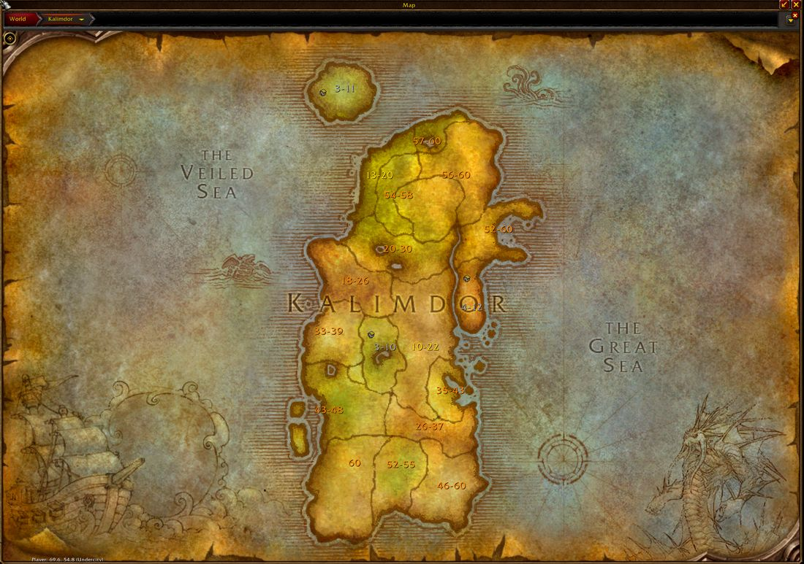
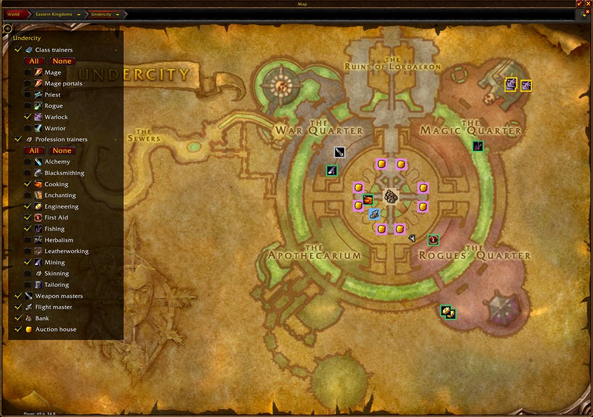

<p align="center">
  
</p>

<h1 align="center">ForeverBuddy</h1>

<p align="center">
  A quality-of-life addon for <strong>World of Warcraft: Forever</strong>.<br>
  Everything in it is a switch. Nothing runs unless you leave it on.
</p>

<p align="center">
  
  
  
</p>

It answers the questions you would otherwise alt-tab for: where should I level next, what does
my class learn at the trainer, what do I actually have to go and buy to craft this, and what is
this item for.



## What it does

**Where to level.** Pick a level band on the left, see where to quest and which dungeon to run on
the right, coloured the way the game colours quest difficulty: yellow is the one to do now, grey
is long behind you. Zones that belong to one side wear that side's emblem. 42 zones.

**Abilities.** Every ability your class learns, level 1 to 60, searchable by name — type "kidney
shot" and it tells you the level. Talents are marked as talents, so you do not go looking for
Trueshot Aura at a trainer. Where somebody has recorded a trainer's list, it knows the price.
1,424 abilities across 9 classes, from the Forever client itself, which differs from Classic: a
paladin gets Hammer of Justice at 8 here, not 20.

**Professions.** Open any profession, pick what you want to make and press **Shopping list**. It
breaks the recipe down to the things nobody can craft, counts what is already in your bags and
bank, and tells you what to go and get. The quantity is presses of Create, the same as Blizzard's
own box, so 2 of a recipe that makes 200 is 2 presses. 2,329 recipes across all 13 professions.

**City maps.** Class trainers, profession trainers, weapon masters, the bank, the auction house
and the flight master, each its own switch, each class and profession its own tick. Our pins stay
under Blizzard's `!` and `?` rather than over them.

**Tooltips.** Which quests and recipes need an item, coloured by how far through those quests you
are, and whether it is safe to vendor.

**At the vendor.** Repairs your gear and sells your greys. Ctrl + right click anything in your
bags to add it to the sell list, or to protect a grey you want to keep. Quests can accept and
hand in themselves, and Shift does it by hand.

`/fb` opens the window, and so does the minimap button; right click that for the settings.
`/fb zones`, `/fb abilities` and `/fb settings` go straight to a page. `/fb craft <item> [n]`
prints a shopping list into chat without opening anything.

## What it looks like

A capital, with each kind of trainer its own switch and each class and profession its own tick:



## Installing

Download the newest release, unzip it, and put the `ForeverBuddy` folder in
`World of Warcraft\_classic_\Interface\AddOns`. There should be a `ForeverBuddy.toc` directly
inside it.

## Recording data

Forever is new, and a lot of it is published nowhere. With **Help improve the data** left on, the
addon writes what the game shows *you* into its own saved-variables file: quests and who gave
them, what trainers teach, what drops from what, and where your talent points went.

It never records chat, keystrokes, other players, or anything from combat, and it never sends
anything anywhere. The file stays on your computer until you choose to share it. `/fb collect`
explains it in game, and `/fb collect off` stops it.

**Sending yours in.** Log out, then find
`World of Warcraft\_classic_\WTF\Account\<your account>\SavedVariables\ForeverBuddy.lua` and
attach it to an issue here, or send it to Leemo on Discord. GitHub will not accept a `.lua`
attachment, so zip it or rename it to `.txt`. The file names the characters you played on, since
talent choices are recorded per character; Discord is the better route if you would rather that
were not public.

## Where the data comes from

| What | Source |
|---|---|
| Quests, dungeon quests, NPC positions | [Questie](https://github.com/Questie/Questie)'s Classic database (GPL-3.0) |
| Item stats and stat weights | [WoWSims](https://github.com/wowsims) Classic (MIT) |
| Item and recipe tables, maps, loading screens | The Forever client's own data files, via [wago.tools](https://wago.tools) |
| Class ability levels | Wowhead's Forever data, corrected by trainer lists players record |
| Forever's own dungeons and zones | Players, and the client's content tuning |

## Licence

GPL-3.0. ForeverBuddy's dungeon and quest data is derived from **Questie**, which is GPL-3.0, so
this addon is too. Credit and thanks to the Questie team, to WoWSims for the stat weights, and to
wago.tools for making the client's own tables readable.

Not affiliated with Blizzard Entertainment. World of Warcraft is a trademark of Blizzard
Entertainment, Inc.

## Contact

Found a bug, or have a dungeon quest write-up for one of Forever's own dungeons? Open an issue
here, or find **Leemo** on Discord.

## Contributing

Bug reports and dungeon quest write-ups are welcome, especially for Forever's own dungeons.
`docs/DEVELOPMENT.md` covers the layout, the generators under `tools/`, and how to run the tests:

```sh
sh tests/run.sh                                   # the addon, under a fake client
python3 -m unittest discover -s tools -p 'test_*.py'   # the data generators
```
